# DS320 Final project
### Team Members:

Kebei Yu

Yulun Wu

Chaolong Shi

### Background
There are hundreds of different national and international university ranking systems like US News and QS. Ranking of universities are affected by a large number of factors. And it is a difficult and controversial practice ranking universities. For both universities and future students, the world rank of top 200 is an important benchmark. 

### Objective
The problems we hope to solve are which factors and models are better predictors to predict whether a university is top 200 or not. We break down the factors into three groups: internal factors, external factors and mixed factors to find the best group of factors and models. 

### Methodology
1. Use data integration techniques to combine data from different sources.
3. Classify features into three groups. 
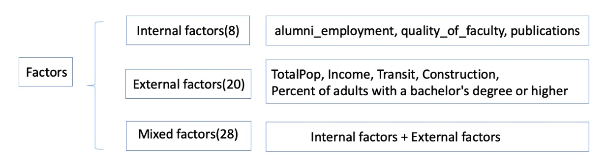
5. Use machine learning such as decision tree,  linear regression to perform analysis on the data and output results for discussions. 
6. Use cross-validation methods to test and evaluate the models, and choose the best models. 
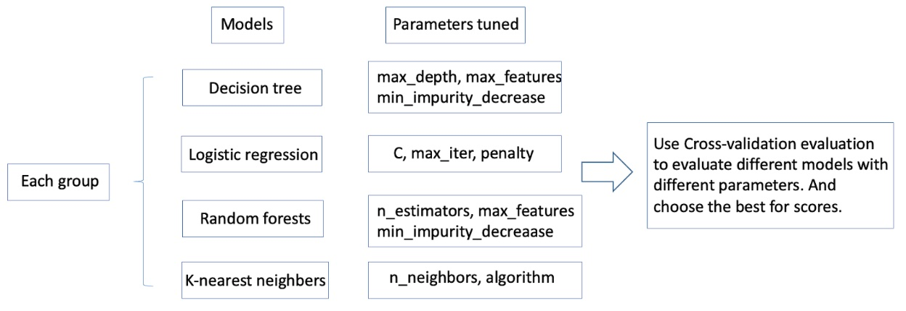

## Part1: Data Preparation
### Data sources
**University Ranking Data**

University Ranking data were published by The Center for World University Rankings (CWUR) in 2019.\
Sources: The Center for World University Rankings (CWUR)
https://www.kaggle.com/mylesoneill/world-university-rankings/download

**University Information Data**

University Location Data is a dataset that contains locations and university and College.
Sources: Private

**Education data**

This data contains the education level data from the American Community Survey for adults 25+. Counts are broken down by sex. And there are 5-year estimates shown by tract, county, and state boundaries.\
Sources: U.S. Census Bureau’s American Community Survey (ACS) 2016-2020 5-year estimates, Table(s) B15002 https://services.arcgis.com/P3ePLMYs2RVChkJx/arcgis/rest/services/ACS_Educational_Attainment_Boundaries/FeatureServer

**Population data**

This data provides boundaries for the States of the United States in the 50 states and the District of Columbia. And the attribute fields include estimated 2017 total population.  \
Sources: Esri, TomTom, U.S. Department of Commerce, U.S. Census Bureau https://services.arcgis.com/P3ePLMYs2RVChkJx/arcgis/rest/services/USA_States_Generalized/FeatureServer

### Data cleaning
* Missing value check: none
* Lower case for future matching
* String revising : delete ‘county’, replace state full name to abbreviation
* Filter year: use the latest info, only us universities
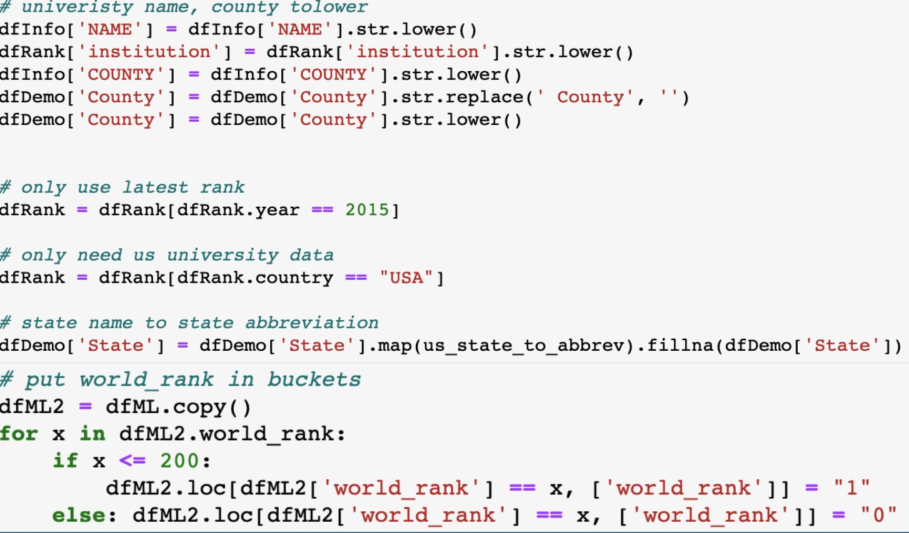

### Data Integraion
* Merge university info to university rank
* Merge education data to demographic data
* Merge local demographic data to university rank(county level) \
Results:
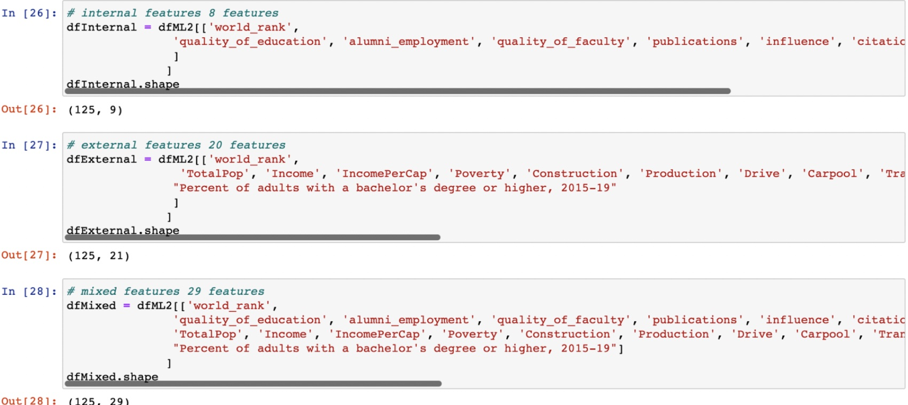

## Part2: Model Analysis
We use four machine learning models for each group of factors we extracted-internal, external and mixed. Next, we employ cross-validation to select which model is best for each group of factors. Finally, we gather the accuracy for each group of factors to decide which group is the best for us to predict.

Machine learning for each group of factors:
* Split function (80% for training & 20% for testing)
* Decision Tree
* Logistic regression
* Random forest
* Knn

Cross-validation for internal factors:
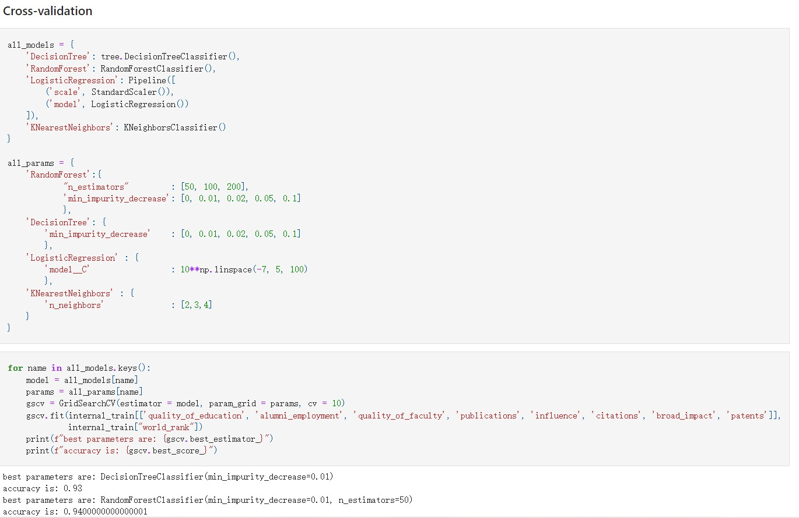
Cross-validation analysis for external factors:
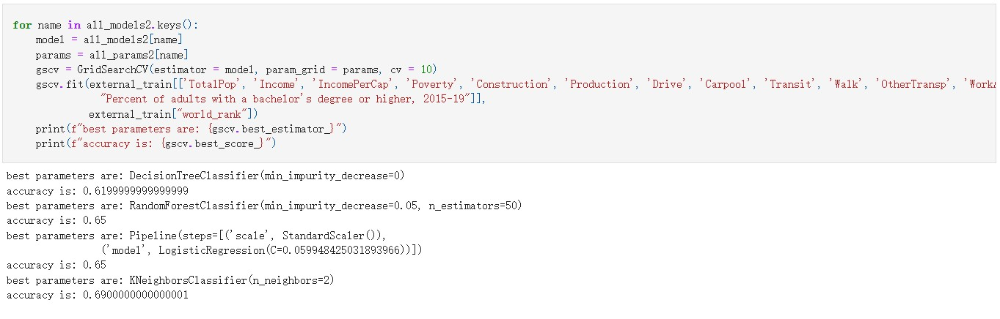
Decesion tree Compare:
         
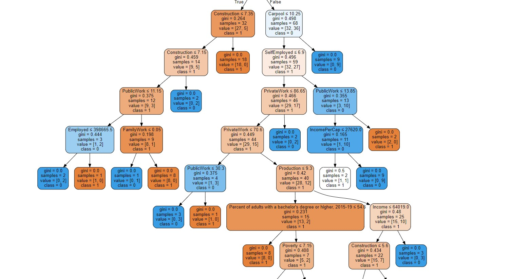

we can see the two type of decision tree, due to the fact that number of internal feature is much less than external, the maximum depth of external is deeer than internal.

Cross-validation analysis for mixed factors:
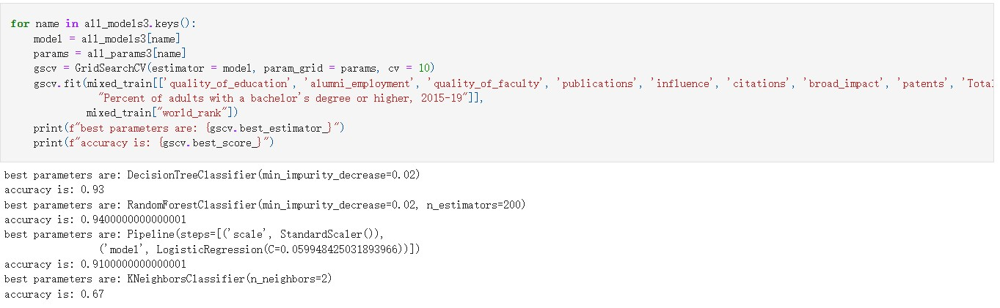
  

Compare correlation between internal and external:
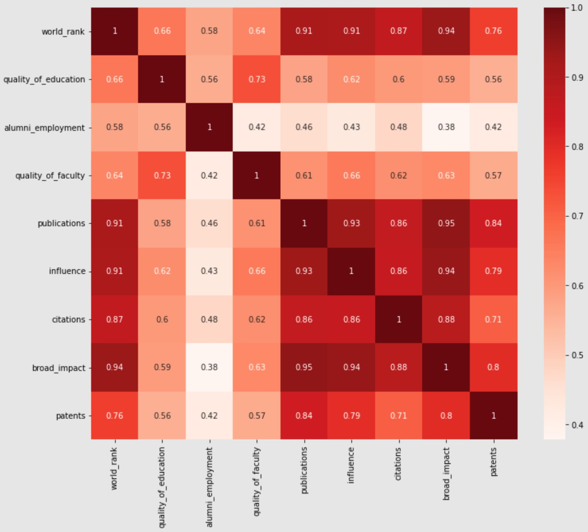
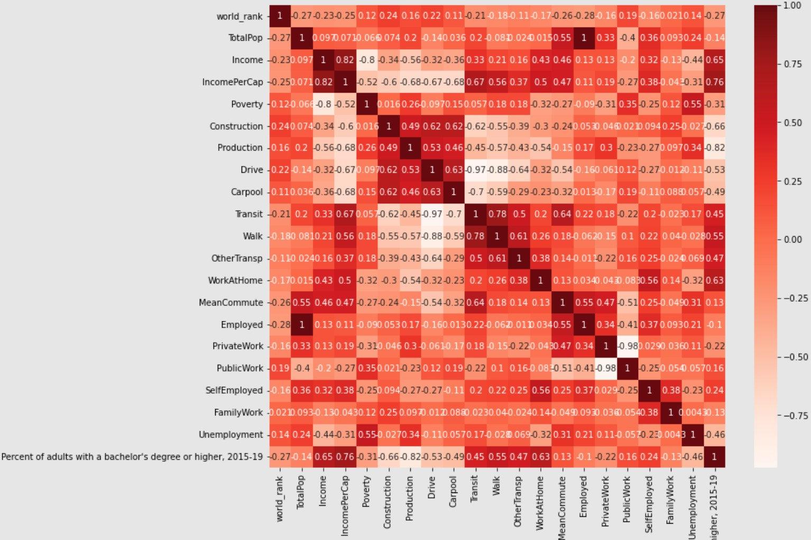
***As the color becomes deeper, more relationship between feature and label***
  
Accuracy for each type of factor:\
Highest for Internal: 0.94（random forest）\
Highest for External: 0.69(random forest & logistic regression\
Highest for Mixed: 0.94(random forest)

## Part3: Findings, Results and Limitations
### Findings
1.Internal prediction >mixed prediction > better than external.
* Both training accuracy and test accuracy is over 90%. In external factors we can see that logistic regression is all over 90% but the other three groups, especially random forest and KNN, are below 80%. In accuracy of mixed factors, although most of them are kind of the same with internal factors, KNN in the accuracy of mixed factors is lower than the KNN from internal factors.
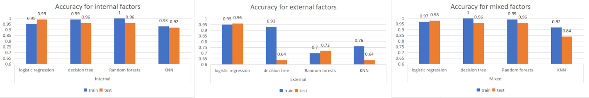

2.Logistic regression is the best overall.
* There are four different modules as we can see in the screenshot below. Both training accuracy and test accuracy in logistic regression are over 95% from our module. However, in the accuracy of the decision tree, internal and mixed factors are better than the external one because the test accuracy of external factors is only 64%. So compared with the other three modules, accuracy of logistic regression is the best module we found.
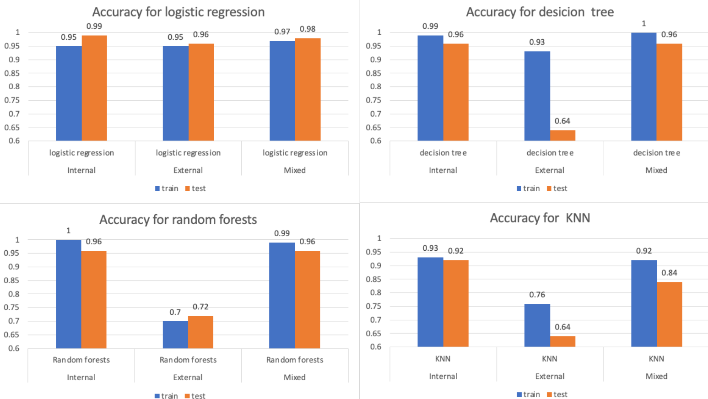

3. Logistic regression, all over 95% test accuracy.
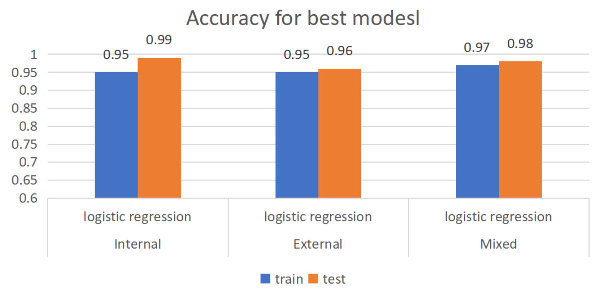

### Results
* Internal prediction is better than mixed prediction and mixed prediction better than external because internal prediction is the best indicator or factor for university rank.
* Logistic regression is the best overall.
* Pearson Correlation proves our outcomes because internal features > external features.

### Limitation
* Only use one rank data, different rank data may have different results.
* Data of internal factors may be different from the real situation. (man-made data, subjective to the people who create the data). For example, quality_of_faculty is an abstract concept which lacks acknowledged standards to evaluate.

### Conclusion
Based on the findings, results and limitations we talked about above. We need more data to help us with training modules.

#### Link to Kaggle Profile:https://oca510.github.io/320html/
